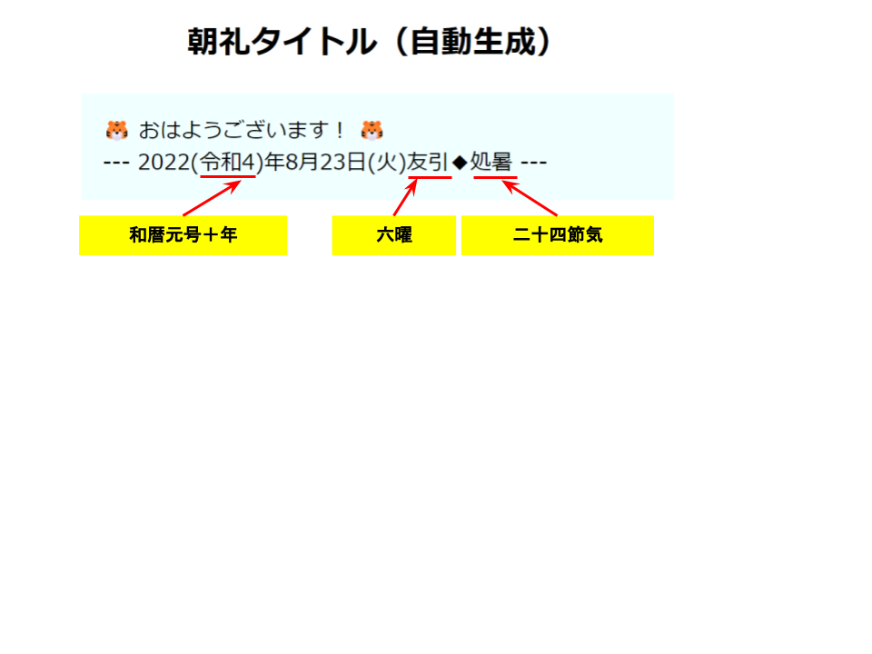

# calendar
## 開発経過と目的
テレワーク盛んな世の中になりましたが、リモートで行うにしても、朝礼は大切なイベントです。弊社はスカイプ等のチャットアプリを利用して行っています。  
チャットの最初の一行目の文字列を自動で生成するために、このアプリを開発しました。

## 使い方
いたって簡単です。

<ol>
<li>index.phpをダウンロードする</li>
<li>そのファイルをWebサーバーにアップする</li>
<li>アップ先のURLをブラウザ表示し、必要な文字列を朝礼アプリなどにコピペする</li>
</ol>

表示例（解説用）

## 謝辞
このアプリは無料で旧暦情報を提供されている[暦APIサイト様](https://koyomi.zing2.org/)のAPIを利用させていただいております。  
従来はその都度個別にネット検索して六曜などを調べておりましたが、このAPIのおかげてずいぶん楽になりました。  
深く御礼申し上げます。